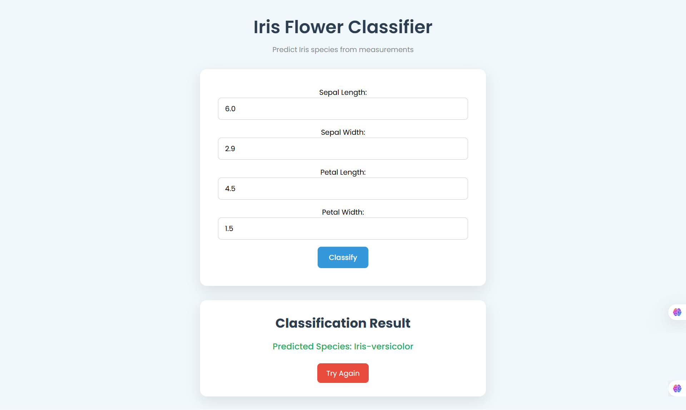
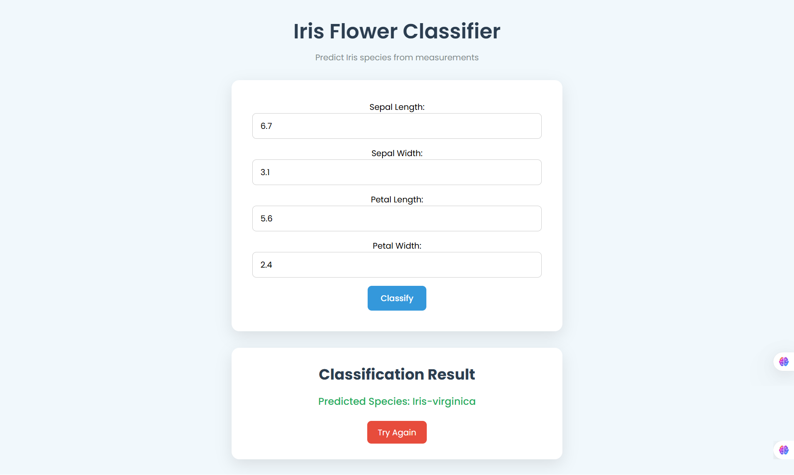

# 🌸 Iris Flower Classification Web App

This is a Flask-based web application that predicts the species of an Iris flower based on user input for sepal and petal dimensions. It uses a trained **Random Forest** model and standard scaler.

## 🔍 Features

- **Input**: Sepal length, sepal width, petal length, petal width
- **Output**: Predicted Iris species (`Setosa`, `Versicolor`, or `Virginica`)
- **ML Model**: Trained using `scikit-learn` on the Kaggle Iris dataset ["Iris Flower Dataset"](https://www.kaggle.com/datasets/arshid/iris-flower-dataset)
- **Web Framework**: Flask

## 🚀 Getting Started

### 1. Clone the Repository

```bash
git clone https://github.com/Sadashrayr/Iris-flower-classification.git
```

### 2. 📦 Install Dependencies

```bash
pip install -r requirements.txt
```

## 📚 Documentation

- **[Requirements](requirements.txt)**: List of dependencies required to run the application.
- **[README.md](README.md)**: This file.
- **[app.py](app.py)**: The main Flask application file.
- **[requirements.txt](requirements.txt)**: List of dependencies required to run the application.
- **[templates/index.html](templates/index.html)**: The HTML template for the application's home page.
- **[static/js/main.js](static/js/main.js)**: The JavaScript file for the application's main functionality.
- **[static/css/main.css](static/css/main.css)**: The CSS file for the application's styling.

## 🖼️ Demo




```